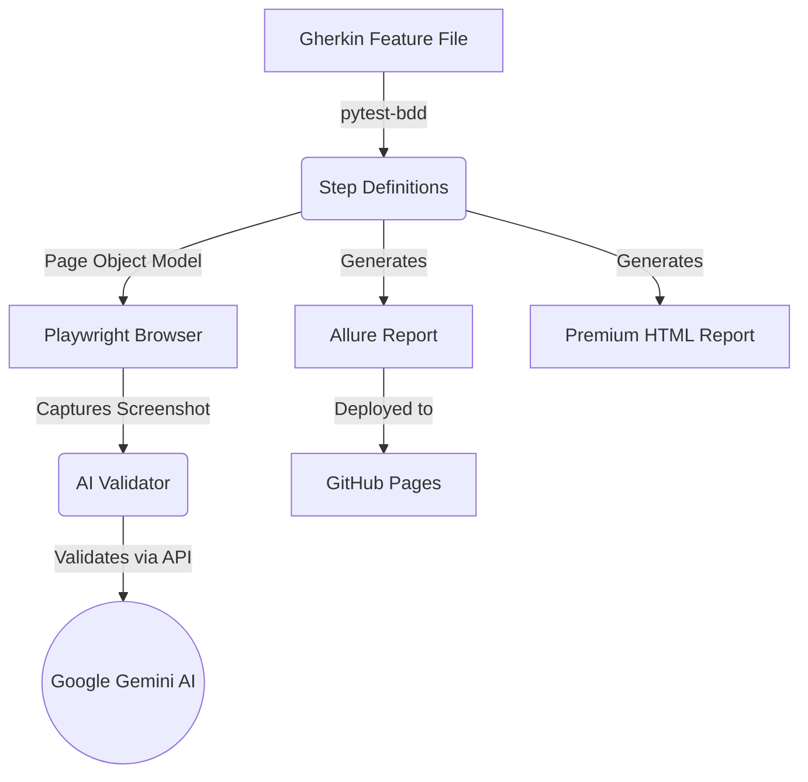

# Enterprise AI Visual Testing Framework 🚀

This repository showcases a modern, scalable, and fully-featured Quality Assurance Automation Framework. It replaces expensive legacy commercial tools (like Applitools) with an open-source architecture that leverages **Playwright** and **Google Gemini AI** for intelligent visual validation.

## 🎯 Key Capabilities
* **AI Visual Validation:** Uses Google's Gemini Vision AI to intelligently assert visual correctness, replacing pixel-to-pixel matching which is prone to flakiness.
* **Accessibility Testing (a11y):** Automatically audits pages for WCAG compliance using `axe-core`.
* **Behavior-Driven Development (BDD):** Tests are written in plain English Gherkin syntax (`Given/When/Then`) using `pytest-bdd`.
* **Page Object Model (POM):** Scalable and maintainable test architecture.
* **Data-Driven Testing (DDT):** Easily test 100s of URLs by feeding a single JSON file to the `Scenario Outline`.
* **Cross-Browser & Parallel Execution:** Automatically runs tests simultaneously across Chromium, Firefox, and WebKit using `pytest-xdist`.
* **Enterprise Reporting:** Dual reporting system — **Allure Report** (deployed to GitHub Pages) and a **Premium HTML Dashboard** with charts, animations, and dark-mode glassmorphism design.
* **CI/CD Cloud Pipeline:** Fully integrated with GitHub Actions to run automatically on every push, with Allure history deployed to GitHub Pages.

---

## 🏗️ Architecture



---

## 🛠️ Tech Stack
- **Language:** Python 3.12+
- **Test Runner:** Pytest
- **Browser Automation:** Playwright
- **BDD Framework:** Pytest-BDD
- **AI Integration:** Google GenAI (Gemini 2.5)
- **Reporting:** Allure + Custom Premium HTML Dashboard
- **CI/CD:** GitHub Actions + GitHub Pages

---

## 🚀 Setup & Execution

### 1. Installation
Clone the repository and install dependencies:
```bash
pip install -r requirements.txt
python -m playwright install --with-deps
```

### 2. Configure API Key
Get a free API key from [Google AI Studio](https://aistudio.google.com/app/apikey).
Set it in your terminal:
```bash
# Windows
$env:GEMINI_API_KEY="your_api_key_here"

# Mac/Linux
export GEMINI_API_KEY="your_api_key_here"
```

### 3. Run Tests
Run the entire suite in parallel across Chrome, Firefox, and Safari:
```bash
python -m pytest
```

*(Note: Configuration for parallel execution and cross-browser targets is managed globally in `pytest.ini`)*

---

## 📊 Test Reports

This framework generates **three** levels of reporting for complete visibility:

### 1. Allure Report (Enterprise Dashboard)
The industry-standard interactive report with test history, categories, and step-by-step execution details.

```bash
# View locally after running tests
allure serve allure-results

# Or generate a static report
allure generate allure-results -o allure-report --clean
```

> 💡 **Live Report:** On CI/CD, the Allure report is automatically deployed to GitHub Pages with full execution history.

### 2. Premium HTML Dashboard
A stunning self-contained dark-mode report with donut charts, animated stat cards, duration timeline, and collapsible error logs. Generated automatically at `reports/premium_report.html`.

### 3. Standard pytest-html
The classic `report.html` is also generated for quick local checks.

---

## 🐳 Docker Execution

This framework is fully containerized. You can run the entire test suite consistently on any machine without installing Python or Playwright locally.

### Build the Docker Image
```bash
docker build -t ai-qa-framework .
```

### Run the Container
Pass your Gemini API key as an environment variable to the container:
```bash
docker run --rm -e GEMINI_API_KEY="your_api_key_here" ai-qa-framework
```

---

## ⏱️ Performance & Load Testing

This framework includes **Locust** for simulating high-concurrency user traffic to test the performance of the underlying APIs.

### Start the Locust Web UI
```bash
locust -f performance/locustfile.py
```
After starting the command, open `http://localhost:8089` in your browser. From the dashboard, you can define how many concurrent users to simulate and watch real-time analytics graphs of your API's performance!
